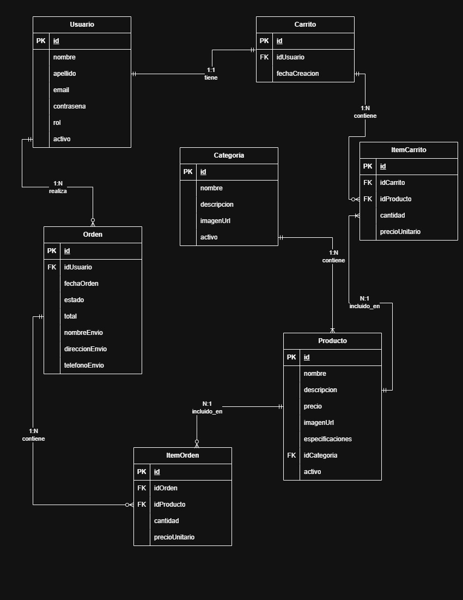

# Proyecto Integrador II

## Etapa 1: Diseño-Segunda entrega.

### Profesora: Cecilia Piombo

### Alumno: Carlos Eduardo Rodriguez

### DNI:28.354.820.

> **Importante:** Cada punto del proyecto tiene una breve descripción de lo que es, desde el punto de vista teórico, con fines de aprendizaje.

## Documentación del Proyecto E-Commerce "Vital CrossFit"

### Objetivos del Proyecto E-Commerce

**Descripción:**
Objetivos del Proyecto

- **Objetivo General:**
  Es la meta principal que el proyecto busca alcanzar.

- **Objetivos Específicos (OE):**
  Son metas concretas y medibles que contribuyen al objetivo general. Se dividen en técnicos (ej. construir una API) y de aprendizaje (ej. aplicar metodologías ágiles).

- **Los Objetivos Funcionales (OF-también llamados _requisitos funcionales_)** definen qué debe hacer el sistema desde la perspectiva del usuario final. Son acciones concretas que la plataforma debe permitir realizar para considerarse operativa.

**Objetivo General:**
Desarrollar una plataforma de E-commerce especializada en productos deportivos, utilizando tecnologías modernas como React, JavaScript, Node.js, Express, MySQL y Sequelize. La plataforma permitirá a los usuarios explorar productos, gestionar un carrito de compras y completar un proceso de compra básico, cumpliendo con los estándares de usabilidad y seguridad.

### Objetivos Específicos (Técnicos y de Aprendizaje):

1.  **OE1 (Backend):** Implementar una API RESTful robusta con Node.js y Express para gestionar usuarios, productos y órdenes.
2.  **OE2 (Base de Datos):** Diseñar y gestionar una base de datos relacional en MySQL utilizando Sequelize, incluyendo modelos, asociaciones, migraciones y seeders.
3.  **OE3 (Frontend):** Construir una interfaz de usuario interactiva y responsiva con React, que consuma la API backend para mostrar información y permitir interacciones.
4.  **OE4 (Autenticación/Seguridad):** Implementar un sistema seguro de registro y login con hashing de contraseñas (bcrypt) y JSON Web Tokens (JWT).
5.  **OE5 (Integración):** Demostrar la integración exitosa entre el frontend y el backend mediante llamadas API (Axios), gestionando el estado de la aplicación con React Context API.
6.  **OE6 (Metodología):** Aplicar metodologías ágiles (Scrum) para la gestión del proyecto, utilizando herramientas como Trello para el seguimiento de tareas.
7.  **OE7 (Integración Externa - Opcional):** Integrar una API externa relevante, como una pasarela de pagos (ej. Mercado Pago SDK).

### Objetivos Funcionales (Producto Mínimo Viable):

- **OF1 (Navegación y Visualización):** Permitir a los visitantes navegar por el catálogo de productos y ver detalles específicos.
- **OF2 (Gestión de Usuarios):** Permitir el registro, inicio de sesión y cierre de sesión de usuarios.
- **OF3 (Carrito de Compras):** Permitir a los usuarios agregar productos al carrito, modificar cantidades y eliminar productos.
- **OF4 (Proceso de Compra):** Implementar un flujo básico de checkout para la creación de órdenes.
- **OF5 (Administración Básica):** Proveer funcionalidades CRUD para la gestión de productos por parte de los administradores.

## Descripción del Cliente y Nicho de Mercado

**Descripción:**

**Nicho de Mercado**

Un segmento especializado de mercado con necesidades específicas.
Ejemplo: "Vital CrossFit" se enfoca en atletas de CrossFit, ofreciendo productos que no encontrarían en tiendas deportivas genéricas.

**Nicho de Mercado:**

- **Nombre del Nicho:** "Vital CrossFit"
- **Descripción:** Una tienda online especializada en la venta de equipamiento, accesorios y suplementos para atletas de CrossFit. Los productos incluyen desde pesas y cuerdas hasta ropa deportiva y suplementos nutricionales, dirigidos a entusiastas y profesionales del CrossFit que buscan calidad y rendimiento.

**Cliente (Usuario Final):**

**Descripción:**

- **Usuario Final:**
  La persona que usará el producto (ej. Ramiro, profesor de educación física). Se define su perfil demográfico, necesidades y frustraciones.
- **Dueño/Promotor:**
  El cliente que encarga el proyecto (ej. la empresa "Vital CrossFit"), con necesidades técnicas y comerciales.

- **Nombre:** Ramiro Garzón
- **Edad:** 34 años
- **Ocupación:** Profesor de educación física
- **Ubicación:** Santiago del Estero- Añatuya
- **Nivel Tecnológico:** Alto. Usuario habitual de aplicaciones móviles y compras online.
- **Valores y Motivaciones:**
  - Busca productos duraderos y de alta calidad que mejoren su rendimiento.
  - Valora marcas reconocidas y reseñas de otros atletas.
  - Prefiere una experiencia de compra rápida y eficiente.
- **Necesidades:**
  - Acceder a un catálogo organizado por categorías (equipamiento, ropa, suplementos).
  - Filtrar productos por marcas o características técnicas.
  - Proceso de compra seguro y sencillo.
- **Frustraciones:**
  - Dificultad para encontrar tiendas especializadas con stock actualizado.
  - Falta de información detallada sobre los productos en tiendas genéricas.

**Cliente (Dueño/Promotor del Proyecto):**

- **Nombre del Cliente (Empresa):** "Vital CrossFit E-Commerce"
- **Tipo:** Emprendimiento enfocado en el mercado deportivo.
- **Misión:** Ofrecer productos de alta calidad, combinando rendimiento y durabilidad.
- **Necesidades Clave:**
  - Plataforma fácil de administrar, con gestión básica de productos y órdenes.
  - Diseño moderno y atractivo que refleje la energía del CrossFit.
  - Funcionalidades esenciales de E-commerce (catálogo, carrito, checkout).
  - Seguridad en transacciones y datos de usuarios.
  - Buena performance en dispositivos móviles.

**Impacto en el Proyecto:**

- **Diseño UI/UX:** Interfaz dinámica con imágenes de alta calidad y navegación intuitiva.
- **Información del Producto:** Campos detallados como peso, material, marca y reseñas (si se implementan).
- **Priorización de Funcionalidades:** Búsqueda por categorías y filtros básicos, proceso de checkout simplificado.
- **Contenido y Tono:** Comunicación enfocada en el rendimiento y la comunidad de amantes del deporte.

## Alcance Funcional: Qué incluirá y qué no incluirá el sistema

**Descripción:**

**Alcance Funcional (In-Scope vs Out-of-Scope)**

Delimitación de lo que sí y no incluirá el sistema.

- **In-Scope:** Funcionalidades esenciales para el MVP (ej. carrito de compras).
- **Out-of-Scope:** Características descartadas en esta fase (ej. reseñas de productos).

### A. Funcionalidades Incluidas (In-Scope):

1.  **Para Usuarios Anónimos:**

    - Navegación por páginas principales (Inicio, Catálogo, Detalle de Producto, Carrito, Login, Registro).
    - Visualización de productos destacados y catálogo completo.
    - Búsqueda básica por nombre o descripción.
    - Visualización del carrito (sin modificación sin sesión activa).

2.  **Para Usuarios Registrados:**

    - Registro, inicio de sesión y cierre de sesión.
    - Gestión del carrito (agregar, modificar cantidades, eliminar productos).
    - Proceso de checkout básico con creación de órdenes.
    - Historial de órdenes realizadas.

3.  **Para Administradores:**
    - Login con rol de administrador.
    - Gestión CRUD de productos (crear, leer, actualizar, eliminar).
    - Visualización básica de usuarios y órdenes.

### B. Funcionalidades NO Incluidas (Out-of-Scope):

- Reseñas y calificaciones de productos.
- Lista de deseos (wishlist).
- Filtros avanzados (por precio, marca, etc.).
- Promociones y descuentos.
- Gestión de envíos complejos (costos basados en ubicación).
- Autenticación social (Google, Facebook).
- Panel de administración avanzado con analíticas.
- Gestión de perfil de usuario (edición de datos).
- Notificaciones por email (confirmación de órdenes, etc.).
- Devoluciones y reembolsos.

---

Estas épicas, historias de usuarios, criterios de aceptación están en KanbanFlow y se accede a ellas por medio del siguiente enlace:
[https://kanbanflow.com/board/Szq94FN](https://kanbanflow.com/board/Szq94FN)

## Épicas del Proyecto

**Descripción:**

**Épicas (Epics)**

Grandes áreas funcionales del proyecto que agrupan historias de usuario relacionadas.
Ejemplo: "Gestión de Productos" incluye HU sobre catálogo, búsqueda y detalles.

**ÉPICA 1: Gestión de Productos y Catálogo**
Permitir a los usuarios explorar y visualizar productos del catálogo de Vital CrossFit.

**ÉPICA 2: Gestión de Usuarios y Autenticación**
Implementar el sistema de registro, login y gestión de usuarios.

**ÉPICA 3: Carrito de Compras y Checkout**
Proporcionar funcionalidades para gestionar el carrito y completar compras.

**ÉPICA 4: Administración del Sistema**
Permitir a los administradores gestionar productos y visualizar información del sistema.

## Historias de Usuario por Épica

**Descripción:**

**Historias de Usuario (HU)**

Descripciones simples de funcionalidades desde la perspectiva del usuario, siguiendo el formato:
"Como [rol], quiero [acción] para [beneficio]".

**Criterios de Aceptación**

Condiciones que una HU debe cumplir para considerarse terminada. Son verificables y específicos.

### ÉPICA 1: Gestión de Productos y Catálogo

#### HU-001: Visualizar página de inicio

> Como usuario anónimo/visitante, quiero ver una página de inicio atractiva con productos destacados para conocer rápidamente qué ofrece la tienda y sentirme motivado a explorar.

**Criterios de Aceptación:**

- La página muestra el logo y nombre "Vital CrossFit"
- Se muestran al menos 4 productos destacados con imagen, nombre y precio
- Existe un menú de navegación claro
- El diseño es responsivo para dispositivos móviles
- Los productos destacados son clickeables y redirigen al detalle

#### HU-002: Navegar por el catálogo completo

> Como usuario anónimo/visitante, quiero ver todos los productos disponibles en una página de catálogo para explorar toda la oferta de la tienda.

**Criterios de Aceptación:**

- Se muestran todos los productos activos de la base de datos
- Cada producto muestra imagen, nombre, precio y descripción breve
- Los productos se muestran en formato de grilla responsiva
- Existe paginación si hay más de 20 productos
- Cada producto es clickeable para ver el detalle

#### HU-003: Ver detalle de producto

> Como usuario anónimo/visitante, quiero ver información detallada de un producto específico para tomar una decisión de compra informada.

**Criterios de Aceptación:**

- Se muestra imagen principal del producto
- Se visualiza nombre, precio, descripción completa
- Se muestran especificaciones técnicas (peso, material, marca)
- Existe botón "Agregar al carrito" (funcional solo para usuarios registrados)
- Se puede navegar de vuelta al catálogo
- El diseño es responsivo

#### HU-004: Buscar productos

> Como usuario anónimo/visitante, quiero buscar productos por nombre o descripción para encontrar rápidamente lo que necesito.

**Criterios de Aceptación:**

- Existe una barra de búsqueda visible en la navegación
- La búsqueda funciona por nombre y descripción del producto
- Los resultados se muestran en formato similar al catálogo
- Se muestra mensaje si no hay resultados
- La búsqueda no es sensible a mayúsculas/minúsculas

### ÉPICA 2: Gestión de Usuarios y Autenticación

#### HU-005: Registrarse como usuario

> Como visitante, quiero crear una cuenta de usuario para poder realizar compras y gestionar mi carrito.

**Criterios de Aceptación:**

- Formulario con campos: nombre, email, contraseña, confirmar contraseña
- Validación de formato de email
- Validación de contraseña (mínimo 6 caracteres)
- Verificación de que las contraseñas coincidan
- Verificación de que el email no esté registrado
- Contraseña se almacena hasheada con bcrypt
- Redirección al login tras registro exitoso
- Mensajes de error claros

#### HU-006: Iniciar sesión

> Como usuario registrado, quiero iniciar sesión con mi email y contraseña para acceder a las funcionalidades de cliente.

**Criterios de Aceptación:**

- Formulario con campos email y contraseña
- Validación de credenciales contra la base de datos
- Generación de JWT token para sesión
- Redirección a página principal tras login exitoso
- Persistencia de sesión en el navegador
- Mensajes de error para credenciales incorrectas
- Diferenciación entre usuario regular y administrador

#### HU-007: Cerrar sesión

> Como usuario registrado, quiero cerrar mi sesión para proteger mi cuenta cuando termine de usar la aplicación.

**Criterios de Aceptación:**

- Botón "Cerrar sesión" visible cuando hay sesión activa
- Eliminación del token de autenticación
- Redirección a página principal
- Confirmación visual del cierre de sesión
- Restricción de acceso a páginas protegidas

### ÉPICA 3: Carrito de Compras y Checkout

#### HU-008: Agregar productos al carrito

> Como usuario registrado, quiero agregar productos a mi carrito para comprarlos posteriormente.

**Criterios de Aceptación:**

- Botón "Agregar al carrito" visible en detalle de producto
- Solo usuarios autenticados pueden agregar productos
- Se especifica cantidad a agregar (default: 1)
- Confirmación visual cuando se agrega producto
- Actualización del contador de productos en carrito
- Persistencia del carrito durante la sesión

#### HU-009: Ver carrito de compras

> Como usuario registrado, quiero ver todos los productos en mi carrito para revisar mi selección antes de comprar.

**Criterios de Aceptación:**

- Lista de productos con imagen, nombre, precio unitario y cantidad
- Cálculo del subtotal por producto
- Cálculo del total general del carrito
- Acceso desde cualquier página mediante ícono/enlace
- Mensaje cuando el carrito está vacío
- Enlaces a detalle de cada producto

#### HU-010: Modificar carrito

> Como usuario registrado, quiero modificar las cantidades o eliminar productos de mi carrito para ajustar mi pedido antes de comprar.

**Criterios de Aceptación:**

- Botones para aumentar/disminuir cantidad de cada producto
- Botón para eliminar producto completamente
- Actualización automática de subtotales y total
- Confirmación antes de eliminar productos
- Validación de cantidades mínimas (1) y máximas (stock disponible)

#### HU-011: Realizar checkout básico

> Como usuario registrado, quiero completar el proceso de compra para generar mi orden y finalizar la transacción.

**Criterios de Aceptación:**

- Formulario con datos de envío (nombre, dirección, teléfono)
- Resumen de productos y total de la orden
- Botón "Confirmar compra" que genera la orden
- Creación de registro en tabla de órdenes
- Vaciado del carrito tras compra exitosa
- Mensaje de confirmación con número de orden
- Redirección a página de confirmación

#### HU-012: Ver historial de órdenes

> Como usuario registrado, quiero ver mis órdenes anteriores para hacer seguimiento de mis compras.

**Criterios de Aceptación:**

- Lista de órdenes del usuario ordenadas por fecha (más reciente primero)
- Información: número de orden, fecha, total, estado
- Detalle de productos por orden
- Acceso desde menú de usuario o perfil
- Paginación si hay muchas órdenes

### ÉPICA 4: Administración del Sistema

#### HU-013: Login como administrador

> Como administrador, quiero iniciar sesión con credenciales administrativas para acceder al panel de administración.

**Criterios de Aceptación:**

- Mismo formulario de login que usuarios regulares
- Verificación de rol administrativo en base de datos
- Acceso a rutas protegidas de administración
- Interfaz diferenciada para administradores
- Redirección a panel administrativo tras login

#### HU-014: Gestionar productos - Crear

> Como administrador, quiero crear nuevos productos para mantener actualizado el catálogo.

**Criterios de Aceptación:**

- Formulario con todos los campos del producto (nombre, descripción, precio, imagen, categoría, etc.)
- Validación de campos obligatorios
- Subida de imágenes de producto
- Asignación automática de fecha de creación
- Confirmación tras creación exitosa
- Redirección a lista de productos

#### HU-015: Gestionar productos - Visualizar

> Como administrador, quiero ver todos los productos para tener una visión general del inventario.

**Criterios de Aceptación:**

- Lista tabular con todos los productos
- Columnas: ID, nombre, precio, stock, estado, acciones
- Búsqueda por nombre o ID
- Filtrado por estado (activo/inactivo)
- Paginación para manejar muchos productos
- Enlaces a editar y eliminar

#### HU-016: Gestionar productos - Actualizar

> Como administrador, quiero editar productos existentes para mantener la información actualizada.

**Criterios de Aceptación:**

- Formulario pre-cargado con datos actuales del producto
- Posibilidad de modificar todos los campos
- Validación de datos actualizados
- Opción de cambiar imagen del producto
- Confirmación antes de guardar cambios
- Redirección a lista tras actualización exitosa

#### HU-017: Gestionar productos - Eliminar

> Como administrador, quiero eliminar productos obsoletos para mantener el catálogo limpio.

**Criterios de Aceptación:**

- Confirmación obligatoria antes de eliminar
- Eliminación lógica (cambio de estado) en lugar de física
- Verificación de que el producto no esté en órdenes pendientes
- Mensaje de confirmación tras eliminación
- Actualización automática de la lista

#### HU-018: Visualizar usuarios y órdenes

> Como administrador, quiero ver información básica de usuarios y órdenes para tener control sobre la operación.

**Criterios de Aceptación:**

- Lista de usuarios registrados con información básica
- Lista de órdenes con fecha, usuario, total y estado
- Búsqueda básica por email o número de orden
- Sin capacidad de edición (solo visualización)
- Paginación para manejar grandes volúmenes

---

## Product Backlog Priorizado

**Descripción:**

**Product Backlog Priorizado**

Lista de HU ordenadas por importancia (alta, media, baja prioridad).

- **Must Have (MVP):** Funciones sin las cuales el producto no funciona (ej. checkout).
- **Should/Could Have:** Mejoras o features no críticas

### ALTA PRIORIDAD (Must Have - MVP)

1.  **HU-006: Iniciar sesión** - Fundamental para funcionalidad de usuarios registrados
2.  **HU-005: Registrarse como usuario** - Necesario para crear base de usuarios
3.  **HU-002: Navegar por el catálogo completo** - Core del e-commerce
4.  **HU-003: Ver detalle de producto** - Esencial para decisiones de compra
5.  **HU-001: Visualizar página de inicio** - Primera impresión del sitio
6.  **HU-008: Agregar productos al carrito** - Funcionalidad crítica de e-commerce
7.  **HU-009: Ver carrito de compras** - Necesario para proceso de compra
8.  **HU-011: Realizar checkout básico** - Completar el flujo de venta
9.  **HU-013: Login como administrador** - Gestión del sistema
10. **HU-014: Gestionar productos - Crear** - Administrar inventario

### MEDIA PRIORIDAD (Should Have)

11. **HU-010: Modificar carrito** - Mejora experiencia de usuario
12. **HU-007: Cerrar sesión** - Seguridad básica
13. **HU-015: Gestionar productos - Visualizar** - Administración eficiente
14. **HU-016: Gestionar productos - Actualizar** - Mantenimiento de catálogo
15. **HU-004: Buscar productos** - Facilita navegación
16. **HU-012: Ver historial de órdenes** - Valor agregado para clientes
17. **HU-017: Gestionar productos - Eliminar** - Administración completa

### BAJA PRIORIDAD (Could Have)

18. **HU-018: Visualizar usuarios y órdenes** - Información administrativa adicional

---

## Estimación de Esfuerzo (Story Points)

**Descripción:**

**Story Points**

Unidad de medida para estimar la complejidad de una HU, basada en esfuerzo, incertidumbre y riesgo. No son horas.
Ejemplo:

- 3 pts: Tarea simple (ej. maquetar una página).
- 8 pts: Tarea compleja (ej. integración con pasarela de pagos).

- **Historias Simples (3 pts):** HU-001, HU-007, HU-009, HU-013
- **Historias Medianas (5 pts):** HU-002, HU-004, HU-006, HU-008, HU-012, HU-015, HU-018
- **Historias Complejas (8 pts):** HU-003, HU-005, HU-010, HU-011, HU-014, HU-016, HU-017

**Total estimado: 94 Story Points**

## Bocetos de Pantallas o wireframes, asociados a las historias de usuarios

Se accede a ellas por medio del siguiente enlace:
[https://www.figma.com/design/XR1fJcgGigMX22ceRT8IW4/e-commerce_vitalCrossFit?node-id=0-1&t=vpyoq2DhnbQvwxOt-1](https://www.figma.com/design/XR1fJcgGigMX22ceRT8IW4/e-commerce_vitalCrossFit?node-id=0-1&t=vpyoq2DhnbQvwxOt-1)

## Diagrama de entidad relación: DER.

[https://drive.google.com/file/d/18TGmmXSA7TIF515q8yfvmd5RdL2Ha0-/view?usp=sharing](https://drive.google.com/file/d/18TGmmXSA7TIF515q8yfvmd5RdL2Ha0-/view?usp=sharing)

## Estructura de la Base de Datos

El DER muestra las siguientes tablas principales:

- **`Usuario`**: Maneja los datos de los usuarios del sistema.
- **`Carrito`**: Contiene los carritos de compra de los usuarios.
- **`Categoría`**: Clasificación de productos.
- **`Producto`**: Información de productos disponibles.
- **`ItemCarrito`**: Productos individuales en un carrito.
- **`Orden`**: Pedidos realizados por usuarios.
- **`ItemOrden`**: Productos individuales en una orden.

## Funcionamiento del Backend

### 1. Gestión de Usuarios

- **Registro**: Crear nuevos usuarios en la tabla `Usuario` con campos obligatorios .
- **Autenticación**: Verificar credenciales (email y contraseña) contra la tabla `Usuario`.
- **Roles**: El campo `rol` determina permisos (ej. `admin`, `cliente`).
- **Activo/Inactivo**: El campo `activo` permite deshabilitar usuarios sin eliminarlos.

### 2. Gestión de Productos y Categorías

- **CRUD de Categorías**: Operaciones básicas para `Categoria` (nombre, descripción, imagen).
- **CRUD de Productos**: Operaciones para `Producto` incluyendo la relación con `Categoria`.
- **Búsqueda y Filtrado**: Por categoría, nombre, especificaciones, etc.

### 3. Gestión del Carrito de Compras

- **Crear Carrito**: Automáticamente al añadir el primer producto.
- **Añadir Productos**:
  - Insertar en `ItemCarrito` con `idCarrito`, `idProducto`, `cantidad` y `precioUnitario`.
  - Verificar disponibilidad del producto.
- **Actualizar Cantidades**: Modificar el registro correspondiente en `ItemCarrito`.
- **Eliminar Productos**: Borrar registros de `ItemCarrito`.
- **Ver Carrito**: Realizar una consulta que una las tablas `Carrito`, `ItemCarrito` y `Producto`.

### 4. Proceso de Compra (Checkout)

- **Crear Orden**:
  - Insertar un nuevo registro en la tabla `Orden` con datos de envío y el total calculado.
  - Mover los ítems desde `ItemCarrito` a `ItemOrden`.
  - Vaciar el carrito (`ItemCarrito`) asociado al usuario.
- **Estados de Orden**: El campo `estado` permite gestionar el flujo del pedido (`pendiente`, `enviado`, `entregado`, `cancelado`).
- **Historial de Compras**: Consulta que une `Orden` e `ItemOrden` para mostrar el historial de un usuario.

### 5. Consultas y Reportes

- **Productos más vendidos**: Agregación sobre `ItemOrden`.
- **Ventas por período**: Filtrado en la tabla `Orden` por `fechaOrden`.
- **Carritos abandonados**: Carritos que tienen `ItemCarrito` pero no se han convertido en una `Orden` después de un tiempo determinado.

## Ejemplo de Flujos

### Flujo de Añadir al Carrito

1.  El **Frontend** envía `idUsuario` e `idProducto` con la `cantidad`.
2.  El **Backend** verifica:
    - Que el usuario exista y esté activo.
    - Que el producto exista y esté activo.
3.  Crea un carrito asociado al usuario (si es el primer producto que agrega), si no busca el carrito asociado al usuario.
4.  Inserta o actualiza el registro en `ItemCarrito`.
5.  Devuelve el contenido del carrito actualizado al frontend.

### Flujo de Checkout

1.  El **Frontend** envía el `idUsuario` y los datos de envío.
2.  El **Backend**:
    - Valida los ítems en el carrito del usuario.
    - Calcula el total de la compra.
    - Crea un nuevo registro en la tabla `Orden`.
    - Mueve los ítems de `ItemCarrito` a `ItemOrden`.
    - Limpia los registros de `ItemCarrito` asociados al carrito del usuario.
3.  Devuelve una confirmación con el número de orden (`idOrden`).
